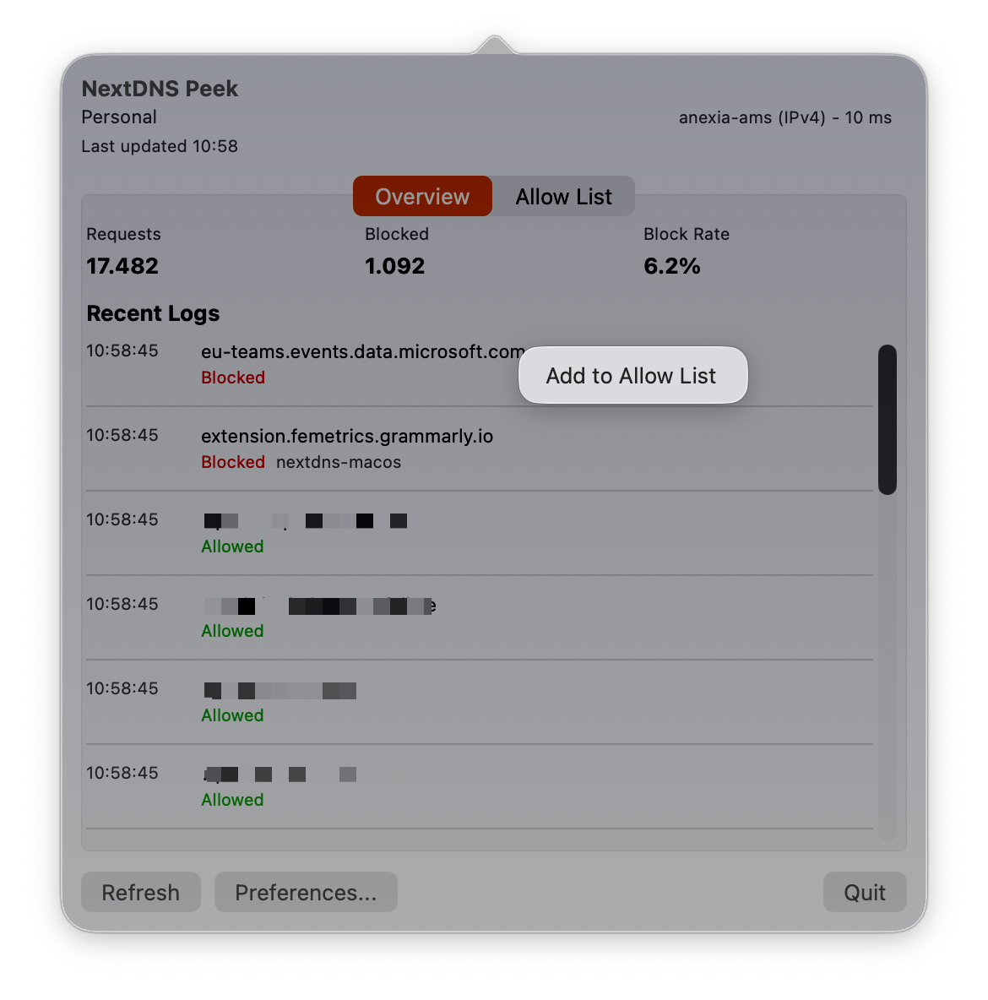

# NextDNS Peek

NextDNS Peek is a macOS menu bar app that shows your NextDNS stats, recent logs, and allow list in a compact popover (floating window).

## Features

- Menu bar app with a SwiftUI popover.
- Overview tab with a compact stats summary (requests, blocked, block rate).
- Recent logs list with time, decision, and optional client/device details.
- Privacy mode that hides domains in the logs.
- Right-click blocked logs to add the domain to the allow list.
- Allow List tab to add domains, enable/disable entries, and remove entries.
- Resolver status indicator with POP and latency when available.
- Refresh controls: manual refresh, refresh on click, and interval-based refresh.
- Time range selection for stats/logs (Last Hour, Last 24 Hours).
- Profile selection and reload from the NextDNS API.
- API token validation, secure Keychain storage, and removal.
- Error banner handling for offline, rate-limited, and unauthorized states.
- Diagnostics panel for last refresh time and last error message.

## Installation

Download the latest DMG from the [Releases](https://github.com/johnlokerse/nextdns-peek/releases) page.

> **Note:** This app is currently ad-hoc signed. When you first open it, you may see a warning that the developer cannot be verified.
>
> 1. Right-click (or Control-click) the app and select **Open**.
> 2. In the dialog that appears, click **Open** again.
>
> If the "Open" button still doesn't appear:
>
> 1. Open **System Settings** > **Privacy & Security**.
> 2. Scroll down to the **Security** section.
> 3. Click **Open Anyway** next to the message about NextDNS Peek.
> 4. Enter your password and confirm by clicking **Open**.
